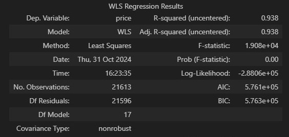

Using a dataset of house prices from (https://www.kaggle.com/datasets/harlfoxem/housesalesprediction)
We aim to build an artificial neural network (ANN) optimized with Keras-Tuner.

♦The first model shows signs of **heteroscedasticity** then we tried several steps to improve the metrics and understanding of the data set.

♦About the data set: 

Number of rows: 21613

Number of columns: 21

We use 18 columns as features (inputs), 1 as target (continuous variable "price"), and drop 2

## First model ANN

♦Hyperparameters:

num_layers: 4

units_0: 243

activation: relu

dropout: False

lr: 0.00038877295727384804

units_1: 441

units_2: 234

units_3: 342

units_4: 252

units_5: 63

units_6: 45

Score: 72580.02265625

♦Metrics: 

MAE:  71293.14455383993

MAPE:  0.12926294242315003

RMSE:  129690.04519255627

## Breusch-Pagan Test

♦ The results show signs of **heteroscedesticity** so we perform a **Breusch-Pagan Test** (WLS.ipynb) wich confirms it (**p-value = 0**).

## Trying to solve **heteroscedesticity**. 

There are several ways to overcome **heteroscedesticity**, one of them is to try to transform the target. 

### ANN with Box-Cox transformation.

We transform the target with **Box-Cox** (ANN_regression_Box_Cox.ipynb) and store its **lambda** value. After training the **ANN** we detransform using the inverse **Box-Cox** function with **lambda** the predicted values and obtain the metrics

♦Metrics:

MAE:  76957.75244332664

MAPE:  0.14025944529697412

RMSE:  141284.0378744411

### WLS model.

Another solution may be to use a weighted least squares (WLS) model that we developed (WLS.ipybn) using the **statsmodels** library.

First we need to get **MSE** from the trained **OLS** model so that we can use it to assign **weights** as parameter in **WLS**.

♦Metrics:

OlS MAE:  125881.5718112254

OlS MAPE:  0.25561092052451

OlS RMSE:  201188.16048555568

==================

WLS MAE:  118120.09129246318

WLS MAPE:  0.21997946214696784

WLS MAPE:  217696.18526827247

♦Results: 

Although **WLS** performs better than **OLS** as it is supposed to do in this case, both models perform poorly compared to our **ANN** with MAE: 72580.02265625.

## Segmentation through Kmeans 

The idea is to build an unsupervised model (Segmentation1.ipybn) to segment the data before applying a regression model to predict the price. Hopefully, we will be able to differentiate complicated data sets from simple ones. We train an optimal Kmeans with **K=13** which shows us that there are two groups of data (3,6) with a wider price range.

Then we separate the data in labels **[3,6]** and **[0,1,2,4,5,7,8,9,10,11,12]** and build an **ANN** for each group 

### ANN for labels **[0,1,2,4,5,7,8,9,10,11,12]** (labels != 3 or 6): 

♦Metrics:

MAE:  61773.60449419276

MAPE:  0.1276305452895651

RMSE:  102346.97434221503

### ANN for labels [3,6]

♦Metrics:

MAE:  189728.11892564403

MAPE:  0.14515582486390521

RMSE:  320830.6859570142

## Quantile attempt 

We treat **heteroscedasticity** as **outliers**

First sort the data and graph .95 quantile:

### Build an ANN classifier to detect whether new data belongs outside (1) or inside (0) the 0.95 quantile

♦Structure: 

Loss: binary_crossentropy

num_layers: 16

units_0: 54

activation: relu

dropout: False

lr: 0.00010406284012562844

units_1: 234

units_2: 135

units_3: 261

units_4: 180

units_5: 261

units_6: 189

units_7: 81

units_8: 243

units_9: 36

units_10: 396

units_11: 18

units_12: 18

units_13: 18

units_14: 18

units_15: 18

Score: 0.04392734244465828

♦Metrics

### Training ANN regression for .95 quantile

♦Metrics:

MAE:  65967.06092114073

MAPE:  0.14311744919508246

RMSE:  96768.70049794603

### Training an ANN regression for .05 

♦Metrics:

MAE:  303073.26987327187

MAPE:  0.1882879259314524

RMSE:  458908.4186139931

### Final and most important step:

We classify all the data through our **ANN classifier** to predict whether they belong to the .95 quantile or not. 

After classification we apply the correct **ANN regression** for their classes

**Notice that there will be misclassified instances and we are interested in how the models will perform**

♦Results: 

**For data classified as 0.95 quantile**: 

MAE:  42503.68199954071

MAPE:  0.09253917253987413

RMSE:  72454.40221470839

**For data classified as 0.05**:

MAE:  198023.983157277

MAPE:  0.12319025379957788

RMSE:  339525.5425219687

## Foot note

I noticed that there is an issue with the WLS formula in the statsmodels documentation.(https://www.statsmodels.org/dev/generated/statsmodels.regression.linear_model.WLS.html)

It is not clear whether we should apply **w^2** or **w**, the first option works better in our **WLS**

There is an open forum on the case:

(https://stackoverflow.com/questions/46000839/is-the-example-of-wls-in-statsmodels-wrong)

